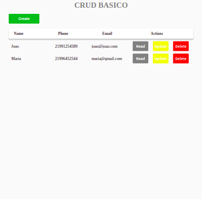

# Crud-Complete

 

### FrontEnd

React  
Styled-components  
Typescript  
Redux  
Redux-Thunk  
Material UI  
Components  
Vercel  

### BackEnd

POO - Programming Oriented Object and Best Pratices  
Tratament of exceptions and errors in Routes  
Flask  
RESTful API  
SGBD PostgreSQL  
DBeaver to connect and manipulate many types of database   
Project organization according to MVC pattern and use of Design Pattern Factory  
